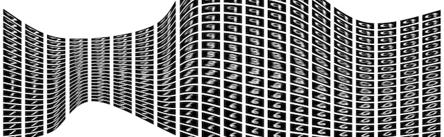

# Advances and Applications on Generative Deep Learning Models (AAGM)

## 26th November 2019, Auckland, New Zealand 

### In conjunction to 5th Asian Conference on Pattern Recognition (ACPR) 
_______

## Motivation

Deep neural networks require the support of large volumes of data to be effectively trained. The quality, variety, and volume of the data are the great differentiator for obtaining a network with a high performance and does not with a mediocre performance. As in general, it is difficult to obtain databases that meet these characteristics, researchers have opted for developing models for data generation. Such generational models can be operated on modest databases, infer the underlying distribution of the data and can be used for generating new data.

The best models for estimating underlying probability densities of data are also based on deep neural networks and a good variety of deep generative models have been proposed. Among such frameworks, Variational Autoencoders (VANs), Generative Antagonist Networks (GANs) and Autoregressive Models are prominent. The aforementioned models have advantages and disadvantages: VANs allow to efficiently compact data into low-dimensional latent spaces, but easily generate blurry samples; GANs allow one to generate data of very good quality, but they are in general difficult to be trained; Autoregressive models are simple and stable though limited to the generation of complex data.

## Topics

The estimation of underlying data density is one of the most active areas in pattern recognition: models that can be sampled to generate synthetic data which is indistinguishable from real data.  For this workshop, we call for original papers focused on reporting advances in deep generative models, as well as the novel applications. Both, theoretical and practical contribution are welcome in related topics, as

- New paradigms of Generative Models
- Interpretability of Latent Variables
- Multimodal Generator Models
- Improvement in the computational efficiency and trainability of the generating models.
-  Exploring reinforcement learning supported by generative models.
- Novel applications of generative models (though limited) such as denoising, super- resolution, and inpainting.
- Compression and pruning generative models

## Author’s Information

Submitted papers should author blinded and do not have been published, accepted or under review elsewhere. Non-peer reviewed media, such as Arxiv do not violate the terms.

Submissions need to follow the single-blind policy and be formatted in LNCS style, with a maximum of 14 pages (including references).

All the papers must be submitted using the provided templates.

- LaTeX2e Proceedings Templates [zip file](ftp://ftp.springernature.com/cs-proceeding/llncs/llncs2e.zip), [Overleaf](https://www.overleaf.com/latex/templates/springer-lecture-notes-in-computer-science/kzwwpvhwnvfj#.WuA4JS5uZpi)
- Microsoft Word Proceedings Templates [zip file](ftp://ftp.springernature.com/cs-proceeding/llncs/word/splnproc1703.zip), [word 2013 zip file](https://resource-cms.springernature.com/springer-cms/rest/v1/content/7117506/data/v1)

Workshop proceedings will be published after the conference in the CCIS series of Springer through the ACPR organizers (publication chair).

**NOTE**: The registration fee for the workshop is included in the conference registration. 
  
## Important Dates

- Paper Submission Deadline: September 15th, 2019 (Extended deadline and Final)
- Notification to Authors:  September 25, 2019
- Camera-Ready Deadline:  October 1, 2019
- Workshop Date: November 26, 2019

## Room WG809

Aukland University of Technology 

City Campus, 

WG Building Level 8

Entrance from Mayoral Drive

## Program

9:30-9:50 Venue

9:50-10:20 **Vehicle-Related Scene Understanding Using Deep Learning.**
Xiaoxu Liu* and Wei Qi Yan (Auckland University of Technology, New Zealand)

10:20-10:50  **Spatiotemporal Saliency based Multi-stream Networks for Action Recognition.** Ming Zong (Massey University)*

10:50-11:20 **Coffe Break**

11:20-11:50 **Attention Guided Unsupervised Image-to-Image Translation with Progressively Growing Strategy.** Yuchen Wu* (University of Electronic Science and Technology of China); Runtong Zhang (University of Electronic Science and Technology of China); Keiji Yanai (Univ. Electro-Comm., Tokyo). 

11:50-12:20 **Human motion generation based on GAN toward unsupervised 3D human pose estimation**. Sasuke Yamane, Hirotake Yamazoe* and Joo-Ho Lee;(Ritsumeikan University)

12:20-12:50 **vi-MoCoGAN: A variant of MoCoGAN for video generation of human hand gestures under different viewpoints.** Thanh-Hai Tran* (Int. Research Inst. MICA, HUST-CNRS/UMI-2954 -GRENOBLE INP, Vietnam), Viet-Dung Bach (Int. Research Inst. MICA, HUST) and Huong Giang Doan (Electric Power University)

  

  

  

  

## Organizing committee

- Mariano Rivera, Center for Research in Mathematics AC, Mexico
- Wei Qi Yan, Centre for Robotics & Vision, Auckland University of Technology, New Zealand
- Wangmeng Zuo, Harbin Institute of Technology, China
- Adrián Pastor Lopez-Monroy, Center for Research in Mathematics AC, Mexico
